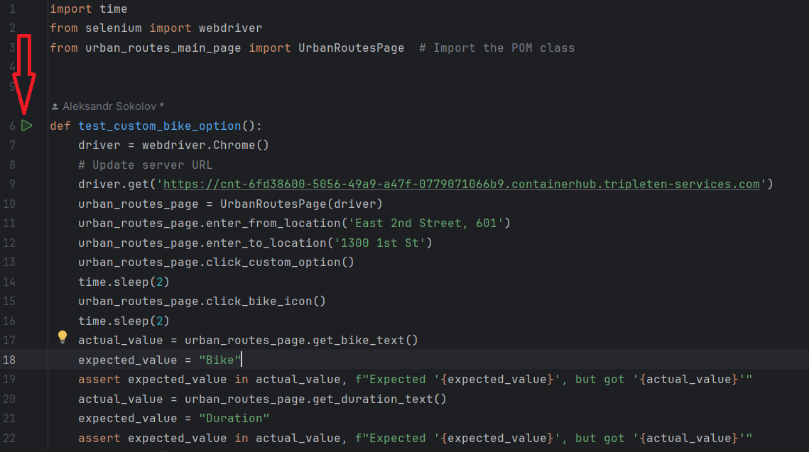

1. To display images correctly in this file, click preview (to the left of the bell with the notifications)
2. Your task is to fill in all the ... in the urban_route_main_page.py file.
3. To make sure you have filled everything in correctly, run the file run_urban_route_main_page.py.
   The test should pass without errors

4. You can find the solution in the Solutions folder. File urban_route_main_page.py
