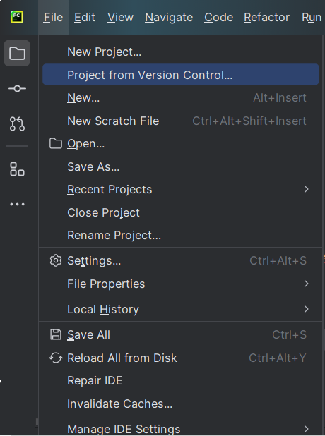
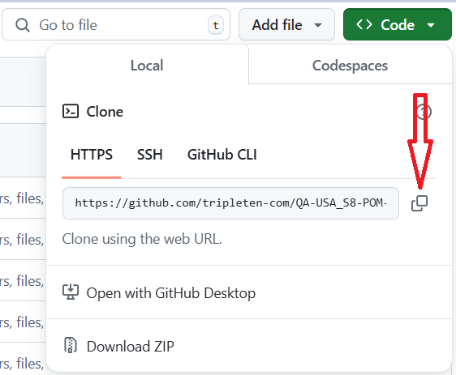
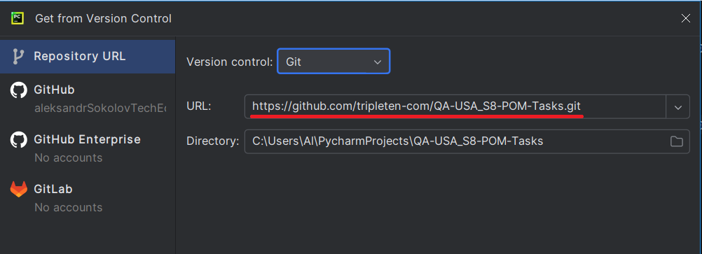

1. click file -> project from version control

2. Paste the link from the git hub and click clone

2. 
3. 
4. Run in the terminal 
python -m venv venv
2. Windows
.\venv\Scripts\activate
   MAc
source venv/bin/activate
3. Install
pip pytest
pip install -r requirements.txt